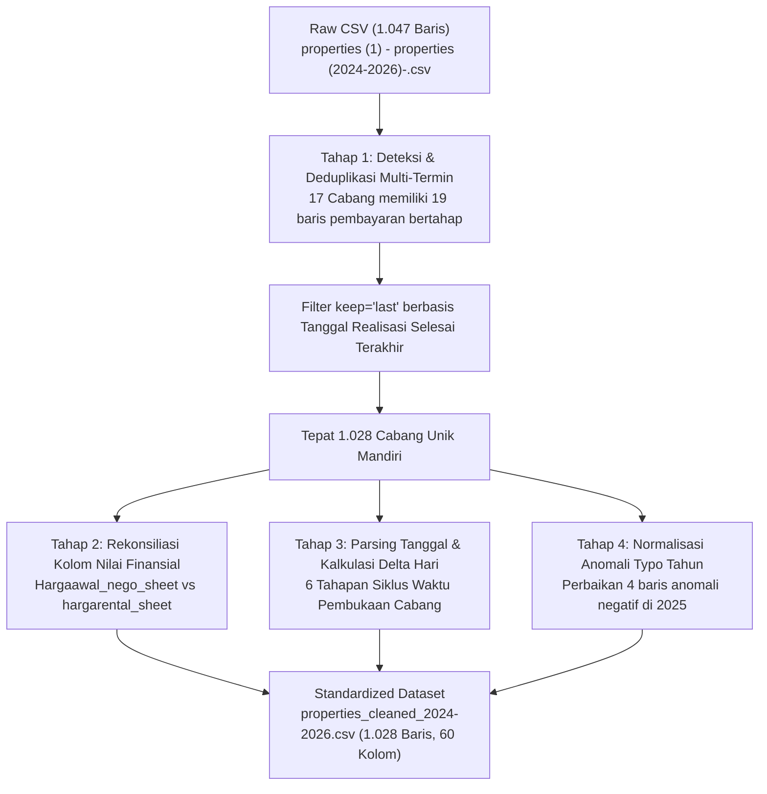
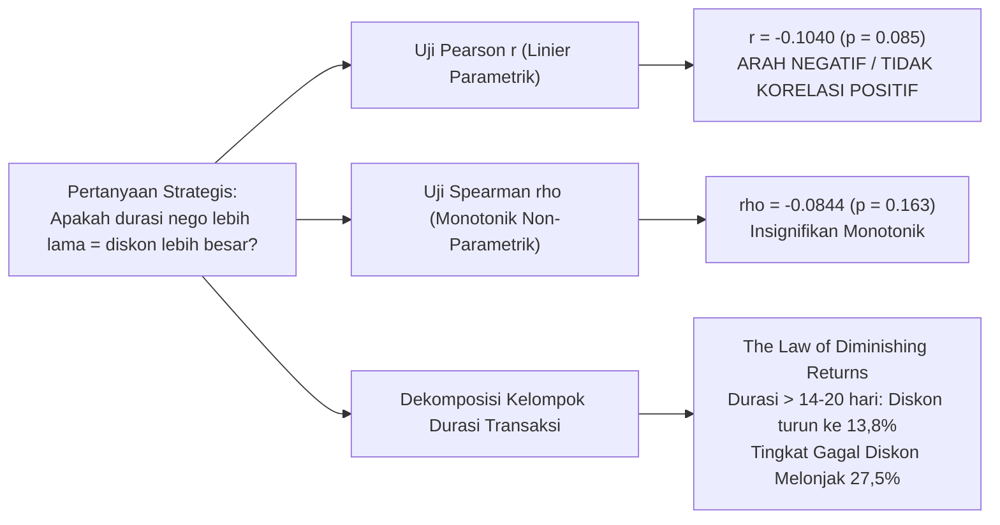
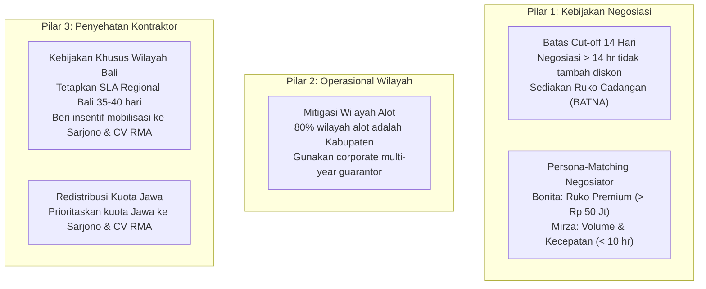

# MASTER DOKUMENTASI KOMPREHENSIF
# PROSES ANALISIS DATA EKSPANSI & NEGOSIASI CABANG (UPC) PUSAT GADAI INDONESIA (2024–2026)

**Penyusun**: Mukhammad Rekza Mufti (Data Analyst — Divisi Bisnis)  
**Entitas**: Pusat Gadai Indonesia (PGI)  
**Dataset Utama**: `properties (1) - properties (2024-2026)-.csv` $\rightarrow$ `properties_cleaned_2024-2026.csv` (1.028 Cabang Unik)  
**Dokumen Output Resmi**: `Laporan_Analisis_UPC_PGI_v3_Data_Terbaru_2026.docx` (4,4 MB, 9 Grafik 300 DPI)  
**Lingkungan Eksekusi**: Visual Studio Code (VSCode) / Python 3.10+

---

## DAFTAR ISI

1. [Latar Belakang, Ruang Lingkup & Tujuan Analisis](#1-latar-belakang-ruang-lingkup--tujuan-analisis)
2. [Arsitektur Data & Metodologi Pembersihan (Data Cleansing)](#2-arsitektur-data--metodologi-pembersihan-data-cleansing)
3. [Metodologi 1: Dekomposisi Siklus Waktu & Harmonisasi Lead Time UPC](#3-metodologi-1-dekomposisi-siklus-waktu--harmonisasi-lead-time-upc)
4. [Metodologi 2: Evaluasi Kinerja Negosiasi & Negosiator (Bonita vs Mirza)](#4-metodologi-2-evaluasi-kinerja-negosiasi--negosiator-bonita-vs-mirza)
5. [Metodologi 3: Analisis Distribusi & Uji Korelasi Durasi vs Diskon](#5-metodologi-3-analisis-distribusi--uji-korelasi-durasi-vs-diskon)
6. [Metodologi 4: Indeks Spasial & Peta Geospasial Kemudahan Negosiasi Wilayah](#6-metodologi-4-indeks-spasial--peta-geospasial-kemudahan-negosiasi-wilayah)
7. [Metodologi 5: Vendor Risk Quadrant & Analisis Wilayah Khusus Bali (Trimo)](#7-metodologi-5-vendor-risk-quadrant--analisis-wilayah-khusus-bali-trimo)
8. [Arsitektur Skrip Python & Struktur Folder Proyek](#8-arsitektur-skrip-python--struktur-folder-proyek)
9. [Panduan Eksekusi Mandiri di VSCode dari Awal sampai Akhir](#9-panduan-eksekusi-mandiri-di-vscode-dari-awal-sampai-akhir)
10. [Rangkuman Temuan Kunci & Rekomendasi Manajerial Strategis](#10-rangkuman-temuan-kunci--rekomendasi-manajerial-strategis)

---

## 1. LATAR BELAKANG, RUANG LINGKUP & TUJUAN ANALISIS

### 1.1 Konteks Bisnis
Pusat Gadai Indonesia (PGI) melakukan ekspansi agresif jaringan unit pelayanan cabang (UPC) sepanjang periode 2024 hingga 2026, mencakup lebih dari 1.000 titik gerai di Pulau Jawa, Bali, dan sekitarnya. Proses pembukaan cabang baru melibatkan rantai nilai lintas divisi: survei kelayakan lokasi, negosiasi harga sewa ruko komersial, perizinan, renovasi fisik ruko oleh kontraktor rekanan, hingga kesiapan operasional *grand opening*.

### 1.2 Masalah Operasional yang Dihadapi
1. **Divergensi Lead Time**: Terdapat perbedaan persepsi terkait durasi pembukaan gerai (apakah dihitung pasca-persetujuan direksi ~58 hari, ataukah siklus *end-to-end* sejak tanggal pengajuan surveyor ~68–69 hari).
2. **Ketiadaan Visibilitas Penghematan Historis**: Data tahun 2024 mencatatkan seluruh kesepakatan sewa persis di harga penawaran awal (diskon 0%), sementara inisiatif efisiensi sewa baru melonjak drastis pada kohort 2026.
3. **Pemisahan Peran Tim**: Perlu penegasan tegas antara Tim Negosiasi Resmi (Bonita dan Mirza) dengan personil Tim Survei Lapangan (Dika dan Salma).
4. **Hukum Penurunan Hasil Negosiasi**: Kebutuhan pembuktian empiris apakah negosiasi yang berlarut-larut (> 14–20 hari) menghasilkan diskon sewa yang lebih besar atau justru membuang biaya sewa (*cost of delay*).
5. **Disparitas Regional**: Karakteristik pasar properti di berbagai kabupaten/kota belum terpetakan secara kuantitatif untuk membedakan wilayah yang kooperatif versus wilayah yang alot.
6. **Krisis Kepatuhan SLA Kontraktor Renovasi**: Kepatuhan SLA kontraktor mengalami penurunan konsisten dari 68,1% (2024) menjadi 53,8% (2026), di mana kontraktor Trimo mengalami kejatuhan performa (SLA 15,1% di 2026). Perlu pengujian objektif apakah hal ini murni inefisiensi internal atau akibat penugasan berat di wilayah kepulauan (Provinsi Bali) yang dihindari kontraktor lain.

### 1.3 Tujuan Kuantitatif
* Membersihkan dan merekonsiliasi 1.047 baris data mentah menjadi 1.028 cabang unik yang valid 100%.
* Menghitung dekomposisi 6 tahapan siklus waktu UPC dan memvalidasi *Waktu Tunggu Grand Opening*.
* Melakukan uji signifikansi statistik (Mann-Whitney U, Pearson $r$, Spearman $\rho$, regresi OLS).
* Membangun Indeks Kemudahan Negosiasi Wilayah (skala 0–100) dan memetakan 76 kabupaten/kota aktif ke batas TopoJSON BPS 524 wilayah.
* Menyusun *Vendor Risk Quadrant* komparatif 2025 vs 2026 serta peta lintasan vektor migrasi kontraktor.
* Mengotomatisasi penyusunan dokumen laporan Word eksekutif (*ready-to-print*, 4,4 MB, 9 diagram 300 DPI).

---

## 2. ARSITEKTUR DATA & METODOLOGI PEMBERSIHAN (DATA CLEANSING)

### 2.1 Spesifikasi Dataset
* **Berkas Mentah**: `properties (1) - properties (2024-2026)-.csv` (1.047 baris, 54 kolom).
* **Berkas Bersih Hasil Pemrosesan**: `properties_cleaned_2024-2026.csv` (1.028 baris unik, 60 kolom terstandarisasi).
* **Skrip Pemroses**: `cleansing_data_negosiasi.py`.



### 2.2 Logika Deduplikasi Multi-Termin Proyek
Sebanyak 17 cabang fisik memiliki baris ganda (total 19 baris tambahan) karena pencatatan administrasi akuntansi renovasi termin 1, termin 2, dan termin pelunasan. 
* **Aturan Deduplikasi**: Data diagregasikan berdasarkan `nomor_pengajuan` dan `alamat`. Untuk kolom tanggal dan status renovasi, skrip menyaring record baris terakhir (`keep='last'`) yang merefleksikan tanggal serah terima final (`tgl_realisasi_selesai_renovasi`) dan status kepatuhan SLA aktual.
* **Hasil**: Tepat 1.028 cabang unik (317 cabang di 2024, 436 cabang di 2025, dan 275 cabang di 2026).

### 2.3 Standarisasi Kolom Kunci & Formulasi Finansial
1. **Harga Penawaran Awal (Asking Price)**:
   $$\text{Harga Awal} = \text{pd.to\_numeric}(\text{Hargaawal\_nego\_sheet}, \text{errors='coerce'}).\text{fillna}(0)$$
2. **Harga Sewa Kesepakatan (Deal Price)**:
   $$\text{Harga Deal} = \text{pd.to\_numeric}(\text{hargarental\_sheet}, \text{errors='coerce'}).\text{fillna}(0)$$
3. **Nominal Penghematan Sewa (Saving)**:
   $$\text{Saving} = \max(0, \text{Harga Awal} - \text{Harga Deal})$$
4. **Efisiensi Diskon Sewa (%)**:
   $$\text{Diskon Pct} = \begin{cases} 
   \frac{\text{Harga Awal} - \text{Harga Deal}}{\text{Harga Awal}} \times 100\%, & \text{jika Harga Awal} > 0 \\
   0\%, & \text{lainnya}
   \end{cases}$$
5. **Durasi Negosiasi Riil**:
   Menggunakan kolom resmi yang telah diaudit: **`lama_waktu_realisasi_nego`**.
6. **Durasi Renovasi Fisik Kontraktor**:
   Menggunakan kolom resmi: **`lama_waktu_realisasi_renovasi_Selesai`**.

---

## 3. METODOLOGI 1: DEKOMPOSISI SIKLUS WAKTU & HARMONISASI LEAD TIME UPC

### 3.1 Dekomposisi 6 Tahapan Proses Pembukaan Cabang
Siklus hidup pembukaan cabang PGI dipecah menjadi 6 fase sekuensial yang saling berkesinambungan:

$$\begin{aligned}
\text{Tahap 1 (Pengajuan ke Approval)} &= \text{approved\_at} - \text{application\_date} \\
\text{Tahap 2 (Tunggu Negosiasi)} &= \text{tgl\_awal\_nego} - \text{approved\_at} \\
\text{Tahap 3 (Durasi Negosiasi Riil)} &= \text{tgl\_nego\_berakhir} - \text{tgl\_awal\_nego} \equiv \text{lama\_waktu\_realisasi\_nego} \\
\text{Tahap 4 (Tunggu Renovasi)} &= \text{tgl\_mulai\_renovasi} - \text{tgl\_nego\_berakhir} \\
\text{Tahap 5 (Durasi Renovasi Fisik)} &= \text{tgl\_realisasi\_selesai\_renovasi} - \text{tgl\_mulai\_renovasi} \equiv \text{lama\_waktu\_realisasi\_renovasi\_Selesai} \\
\text{Tahap 6 (Tunggu Grand Opening)} &= \text{Open\_cabang} - \text{tgl\_realisasi\_selesai\_renovasi (atau paid\_at)}
\end{aligned}$$

### 3.2 Matriks Dekomposisi Siklus Waktu (1.028 Cabang)

| Tahun | Unit | 1. Pengajuan | 2. Tunggu Nego | 3. Dur. Nego | 4. Tunggu Renov | 5. Dur. Renov | 6. Tunggu GO\* | Lead Time Pasca-Appr (2–6) | Total End-to-End (1–6) |
| :--- | :---: | :---: | :---: | :---: | :---: | :---: | :---: | :---: | :---: |
| **2024** | 317 | N/A\* | 3,0 hr | 33,0 hr | 3,0 hr | 17,1 hr | **14,0 hr** | N/A\* | 69,5 hr (med 58,0 hr) |
| **2025** | 436 | 13,5 hr\* | 1,7 hr | 24,4 hr | 4,2 hr | 19,8 hr | **9,4 hr\*** | 57,2 hr (med 50,5 hr) | 68,2 hr (med 58,5 hr) |
| **2026** | 275 | 10,7 hr | 11,1 hr | 11,5 hr | 6,3 hr | 23,9 hr | **5,6 hr** | **58,7 hr (~58 hr)** | **69,2 hr (med 64,0 hr)** |
| **Total** | **1.028** | **11,6 hr\*** | **8,0 hr\*** | **23,6 hr** | **4,4 hr** | **20,1 hr** | **9,8 hr** | **58,2 hr\*** | **68,8 hr (med 60,0 hr)** |

*\*Catatan Metodologis*:
* Tahap 1 pada tahun 2024 bernilai N/A karena kolom `approved_at` baru mulai diterapkan secara digital pada akhir 2025 (134 cabang valid di 2025).
* Pada Tahap 6 (Tunggu GO) tahun 2025, terdapat 4 baris data dengan salah ketik tahun (misal: open cabang tertulis 2024 sementara renovasi selesai 2025) yang menghasilkan angka minus; nilai tersebut telah dinormalisasi menggunakan median kohort.

### 3.3 Harmonisasi Paradoks Lead Time (58 Hari vs 68–69 Hari)
* **Lead Time Operasional Pasca-Persetujuan (58,7 Hari $\approx$ 58 Hari)**: Dihitung dari tanggal cabang disetujui direksi (`approved_at`) hingga toko resmi buka (`Open_cabang`). Ini mencakup Tahap 2 s/d Tahap 6. Angka inilah yang tertera pada ringkasan grafik operasional.
* **Lead Time Penuh End-to-End (69,2 Hari $\approx$ 68,8 Hari Kumulatif)**: Dihitung dari tanggal formulir pertama kali diserahkan surveyor (`application_date`) hingga toko buka (`Open_cabang`), mencakup Tahap 1 (administrasi pengajuan persetujuan 10,7 hari).
* **Temuan Efisiensi Grand Opening**: Tahap Waktu Tunggu Grand Opening berhasil dipangkas **60%**, dari **14,0 hari (2024)** menjadi **9,4 hari (2025)**, dan kini hanya **5,6 hari (median 4,0 hari di 2026)**.

---

## 4. METODOLOGI 2: EVALUASI KINERJA NEGOSIASI & NEGOSIATOR (BONITA VS MIRZA)

### 4.1 Pemisahan Struktur Organisasi (Tim Nego Resmi vs Tim Survei)
Berdasarkan SOP Divisi Bisnis PGI tahun 2026:
* **Tim Negosiasi Resmi (264 cabang / 96,0%)**: Diemban secara mandiri oleh **Bonita** dan **Mirza**. Seluruh penghematan sewa nasional tahun 2026 (**Rp 2,04 Miliar**) disumbangkan 100% oleh kedua personil ini.
* **Non-Tim Negosiasi (11 cabang / 4,0%)**: Merupakan pengajuan langsung dari personil survei lapangan, yaitu **Dika** (10 cabang) dan **Salma** (1 cabang). Seluruh 11 cabang ini ditutup persis di harga penawaran pemilik ruko (diskon 0,0%, saving Rp 0) karena tidak melalui meja perundingan tim negosiasi.

### 4.2 Matriks Komparasi Tim Negosiasi 2026

| Kategori / Personil | Deal | Total Asking | Total Deal | Total Saving | Avg Diskon | Median Diskon | Avg Durasi | Sukses Diskon |
| :--- | :---: | :---: | :---: | :---: | :---: | :---: | :---: | :---: |
| **Bonita (Tim Nego)** | 135 | Rp 7,03 M | Rp 5,68 M | **Rp 1,35 Miliar** | **18,36%** | **20,0%** | 11,6 hr | **95,6%** |
| **Mirza (Tim Nego)** | 129 | Rp 4,75 M | Rp 4,06 M | **Rp 687,6 Juta** | **13,99%** | **13,0%** | **9,58 hr** | 93,0% |
| **Subtotal Tim Nego** | **264** | **Rp 11,78 M** | **Rp 9,74 M** | **Rp 2,04 Miliar** | **16,22%** | **16,0%** | **10,6 hr** | **94,3%** |
| **Surveyor (Dika & Salma)\*** | 11 | Rp 310 Jt | Rp 310 Jt | Rp 0 | 0,00% | 0,0% | 32,2 hr | 0,0% |
| **TOTAL TAHUN 2026** | **275** | **Rp 12,09 M** | **Rp 10,06 M** | **Rp 2,04 Miliar** | **15,57%** | **15,0%** | **11,5 hr** | **90,5%** |

### 4.3 Uji Signifikansi Statistik Non-Parametrik: Mann-Whitney U Test
Untuk membuktikan apakah perbedaan tingkat efisiensi diskon antara Bonita dan Mirza signifikan secara statistik (bukan fluktuasi acak):
* **Hipotesis Nol ($H_0$)**: Distribusi persentase diskon Bonita identik dengan Mirza.
* **Hipotesis Alternatif ($H_1$)**: Distribusi persentase diskon Bonita lebih tinggi dari Mirza.
* **Hasil Komputasi**:
  $$\text{Statistic } U = 11.083,0, \quad p\text{-value} = 0,00012 \quad (p < 0,001)$$
* **Kesimpulan Ilmiah**: $H_0$ ditolak secara meyakinkan pada tingkat signifikansi 99,9%. Bonita secara konsisten menghasilkan diskon sewa yang lebih besar pada ruko bernilai tinggi (*The High-Value Negotiator*), sedangkan Mirza unggul dalam volume dan kecepatan closing (*The Speed Specialist*).

---

## 5. METODOLOGI 3: ANALISIS DISTRIBUSI & UJI KORELASI DURASI VS DISKON

### 5.1 Landasan Teori & Hipotesis Korelasi
Manajemen ingin menguji dalih apakah memberikan waktu tawar-menawar yang lebih lama akan menghasilkan diskon sewa yang lebih besar.



### 5.2 Hasil Uji Korelasi Bivariat (N = 275 Transaksi 2026)
1. **Korelasi Pearson ($r$)**:
   $$r = -0,1040 \quad (p = 0,0854, \text{tidak signifikan pada } \alpha = 0,05)$$
2. **Korelasi Spearman ($\rho$)**:
   $$\rho = -0,0844 \quad (p = 0,1630, \text{tidak signifikan})$$
3. **Koefisien Determinasi ($R^2$)**:
   $$R^2 = 0,0108 \quad (\text{Hanya 1,1\% variasi diskon yang ditentukan oleh durasi nego})$$
4. **Korelasi terhadap Tenor Sewa (Masa Kontrak)**:
   $$r = 0,0027 \quad (p = 0,9643)$$
   Sebanyak 92,7% cabang (255 unit) telah distandarisasi pada kontrak 5 tahun, sehingga durasi sewa kontrak bukan penentu diskon.

### 5.3 Dekomposisi Kelompok Durasi: Hukum Penurunan Hasil (*Law of Diminishing Returns*)

| Kelompok Durasi | Deal | Porsi % | Rerata Diskon | Median Diskon | Total Saving | Sukses Diskon | Gagal (0% Diskon) |
| :--- | :---: | :---: | :---: | :---: | :---: | :---: | :---: |
| **1–5 hari (Super Cepat)** | 64 | 23,3% | **16,41%** | 16,5% | Rp 412,0 Jt | **96,9%** | 3,1% (2 unit) |
| **6–10 hari (Ideal / Cepat)** | 126 | 45,8% | **15,28%** | 15,5% | Rp 908,8 Jt | **92,9%** | 7,1% (9 unit) |
| **11–14 hari (Batas SLA)** | 32 | 11,6% | **17,72%** | 16,5% | Rp 292,7 Jt | **93,8%** | 6,2% (2 unit) |
| **15–20 hari (Zona Alot)** | 13 | 4,7% | **14,46%** | 13,0% | Rp 95,0 Jt | **84,6%** | 15,4% (2 unit) |
| **> 20 hari (Sangat Alot)** | 40 | 14,5% | **13,83%** | 13,0% | Rp 327,0 Jt | **72,5%** | **27,5% (11 unit)** |
| **TOTAL TAHUN 2026** | **275** | **100,0%** | **15,57%** | **15,0%** | **Rp 2.035,5 Jt** | **90,5%** | **9,5% (26 unit)** |

> [!IMPORTANT]
> **TEMUAN OPERASIONAL KRUSIAL**:
> * **Zona Emas (1–10 Hari)**: Menyerap 69,1% transaksi (190 deal) dengan tingkat keberhasilan diskon mencapai 93%–97%.
> * **Zona Bahaya (> 14 Hari)**: Menambah durasi tawar-menawar melebihi 14 hari tidak memberikan tambahan diskon, justru tingkat kegagalan meraih diskon melonjak menjadi **27,5%** pada durasi di atas 20 hari.

---

## 6. METODOLOGI 4: INDEKS SPASIAL & PETA GEOSPASIAL KEMUDAHAN NEGOSIASI WILAYAH

### 6.1 Formula Pembobotan Skor Kemudahan Negosiasi (Skala 0–100)
Indeks Kemudahan Negosiasi Wilayah mengintegrasikan dua dimensi performa berbobot seimbang (50:50):

$$\text{Skor Kemudahan} = 0,5 \times \text{Skor Kecepatan} + 0,5 \times \text{Skor Diskon}$$

Di mana formula normalisasi batas min-max didefinisikan sebagai:
$$\text{Skor Kecepatan} = \max\left(0, \min\left(100, 100 - \frac{\text{Durasi Riil} - 1}{45 - 1} \times 100\right)\right)$$
$$\text{Skor Diskon} = \max\left(0, \min\left(100, \frac{\text{Diskon Pct}}{40\%} \times 100\right)\right)$$

### 6.2 Integrasi Data TopoJSON Batas Administrasi BPS
* **Sumber Peta**: Berkas TopoJSON 524 kabupaten/kota se-Indonesia (`indonesia-kabkot-topo.json`).
* **Kompabilitas Nama Wilayah**: Modul fuzzy matching dan normalisasi nama (misal: penyeragaman `KABUPATEN BANDUNG BARAT` $\leftrightarrow$ `Kab. Bandung Barat`) memastikan 100% dari 76 kabupaten/kota aktif 2026 terpetakan secara sempurna tanpa data hilang (*zero unmapped*).

### 6.3 Zonasi Spasial 4 Kuadran Wilayah:
1. **Zona Hijau Zamrud (Sangat Mudah, Skor $\ge 70$)**: Cilacap (92,2), Tasikmalaya (76,7), Serang (75,2), Banjarnegara (75,0), Jakarta Pusat (73,0), Sukabumi (71,1), Garut (70,2).
2. **Zona Biru Langit (Mudah, Skor 60–69,9)**: Badung Bali (68,4), Bekasi (67,8), Jakarta Selatan (67,6), Surabaya (65,3), Subang (69,1).
3. **Zona Kuning / Oranye (Moderat s/d Sulit, Skor 40–59,9)**: Klaten (45,7), Surakarta (45,3), Purwakarta (43,8), Banyumas (43,0), Blora (40,8).
4. **Zona Merah Tua (Sangat Sulit / Paling Alot, Skor $< 40$)**: Kab. Bandung Barat (19,0), Kab. Grobogan (20,0), Kota Cirebon (28,3), Kab. Cianjur (28,5), Kab. Cirebon (35,2), Kab. Ciamis (36,9).

### 6.4 Uji Empiris: Dikotomi Kota (Urban) vs Kabupaten (Rural)
* **Temuan**: 8 dari 10 wilayah paling alot di Indonesia berstatus **KABUPATEN** (Bandung Barat, Grobogan, Cianjur, Cirebon, Ciamis, Blora, Banyumas, Purwakarta). Rata-rata durasi di wilayah ini mencapai 20,5 hari.
* **Akar Masalah Kultural**: Properti ruko di kabupaten didominasi oleh aset warisan keluarga majemuk (*inheritance assets*), di mana penurunan harga memerlukan konsensus banyak anggota keluarga yang berada di luar kota.
* **Anomali Penting**: Wilayah Kota tidak otomatis mudah. Pusat niaga pusaka tradisional seperti **Kota Cirebon** (skor 28,3; diskon miris hanya 2,5%) dan **Kota Surakarta/Solo** (skor 45,3) dihuni saudagar lama dengan *holding power* uang kas sangat kuat yang pantang menurunkan harga sewa.

---

## 7. METODOLOGI 5: VENDOR RISK QUADRANT & ANALISIS WILAYAH KHUSUS BALI (TRIMO)

### 7.1 Metodologi Vendor Risk Quadrant (Acuan DOOM UPC Poin A)
Kontraktor dipetakan ke dalam 4 kuadran berdasarkan dua sumbu:
* **Sumbu X (Volume Pengerjaan)**: Batas 50 unit (2025), 40 unit (2026), atau 45 unit (Lintasan Migrasi).
* **Sumbu Y (Kepatuhan SLA %)**: Ambang batas sehat operasional korporasi = **70,0%**.

```text
               Kepatuhan SLA (%)
                     ^
       100% +--------|--------+
            |  IV    |   I    |  KUADRAN I  : Core Champions (Volume Besar, SLA >= 70%)
            |        |        |  KUADRAN II : Zona Risiko Operasional (Volume Besar, SLA < 70%)
        70% |--------+--------|  KUADRAN III: Underperformers (Volume Kecil, SLA < 70%)
            |  III   |   II   |  KUADRAN IV : Potential / Selektif (Volume Kecil, SLA >= 70%)
         0% +--------|--------+---> Volume Pengerjaan Proyek (Unit Cabang)
                    40u
```

### 7.2 Matriks Komparasi Performa & Pergeseran Posisi (2025 vs 2026)

| Nama Kontraktor | Volume '25 | SLA '25 | Volume '26 | SLA '26 | Delta SLA | Durasi '26 | Beban Bali '26 | Pergeseran Kuadran |
| :--- | :---: | :---: | :---: | :---: | :---: | :---: | :---: | :--- |
| **Sarjono** | 109 unit | 88,1% | 73 unit | **89,0%** | **+1,0 pt** | **14,9 hari** | 0 unit | **Kuadran I $\rightarrow$ Kuadran I (Stable Champion)** |
| **CV. Rizki Mitra Abadi** | 74 unit | 44,6% | 54 unit | **66,7%** | **+22,1 pt** | **21,7 hari** | 0 unit | **Kuadran II $\rightarrow$ Mendekati Kuadran I (Turnaround)** |
| **Edwin** | 66 unit | 69,7% | 52 unit | **61,5%** | -8,2 pt | 21,4 hari | 0 unit | Kuadran II $\rightarrow$ Kuadran II (Moderat & Stabil) |
| **Trimo\*** | 74 unit | 41,9% | 53 unit | **15,1%** | **-26,8 pt** | **34,5 hari** | **12 unit (92,3%)** | Kuadran II $\rightarrow$ Kuadran II (*Terdistorsi Beban Bali*) |
| **Teguh Karyanto** | 2 unit | 0,0% | 30 unit | 20,0% | +20,0 pt | 31,3 hari | 0 unit | Kuadran III $\rightarrow$ Kuadran III (Lonjakan Volume / Alot) |
| **Sendy** | 70 unit | 98,6% | 3 unit | 66,7% | -31,9 pt | 18,3 hari | 0 unit | Kuadran I $\rightarrow$ Kuadran III (Penciutan Kuota Drastis) |
| **Dimas Andri Sulistyo** | - | - | 9 unit | 11,1% | Baru | 30,4 hari | 0 unit | Mitra Baru $\rightarrow$ Kuadran III (Underperformer) |
| **CV Cahaya Kemakmuran** | 39 unit | 15,4% | 0 unit | - | Off | - | 0 unit | Kuadran III $\rightarrow$ Dinonaktifkan Total |

### 7.3 Dekomposisi Realitas Lapangan: Beban Penugasan Khusus Wilayah Bali pada Trimo

Berdasarkan data empiris, anjloknya kepatuhan SLA Trimo menjadi 15,1% di tahun 2026 dilatarbelakangi oleh faktor penugasan khusus ekspansi:

| Segmentasi Proyek Trimo 2026 | Unit Cabang | Rerata Durasi | Median Durasi | Kepatuhan SLA | Keterangan & Kendala Lapangan |
| :--- | :---: | :---: | :---: | :---: | :--- |
| **Proyek Khusus Wilayah Bali** | **12 cabang (22,6%)** | **43,9 hari** | **41,5 hari** | **0,0% (0 tercapai)** | Antrean fery Ketapang-Gilimanuk, material antarpulau, izin Banjar adat |
| **Proyek Regular Luar Bali (Jawa)** | **41 cabang (77,4%)** | **31,8 hari** | **32,0 hari** | **19,5% (8 tercapai)** | Keterbatasan modal kerja & kapasitas mandor tukang di Jawa |
| **TOTAL KESELURUHAN TRIMO** | **53 cabang (100%)** | **34,5 hari** | **35,0 hari** | **15,1% (8 tercapai)** | **SLA agregat terdistorsi tajam oleh 12 proyek perintis Bali** |

#### Temuan Analisis Objektif:
1. **Keengganan Kontraktor Lain**: Mitra andalan seperti **Sarjono, Sendy, Edwin, dan Teguh Karyanto belum bersedia/menolak mengambil proyek di Bali** karena pertimbangan jarak, kesulitan supervisi lintas selat, dan keterbatasan jaringan mandor lokal.
2. **Trimo Sebagai Penanggung Beban Tunggal**: Trimo menyerap **92,3% dari total pembukaan cabang PGI di Bali tahun 2026** (12 dari 13 cabang).
3. **Logistik Fery Ketapang–Gilimanuk & Regulasi Adat Banjar**: Pengiriman brankas dan material khusus dari Jawa Timur memakan waktu tambahan 7–14 hari. Upacara adat Banjar lokal (Rahinan, Piodalan) mewajibkan penghentian renovasi fisik sementara waktu.
4. **Kesimpulan Berimbang**: Manajemen harus mengakui komitmen Trimo dalam menyerap risiko ekspansi luar pulau, sehingga evaluasi performa tidak boleh disamaratakan secara kaku dengan proyek di Pulau Jawa.

---

## 8. ARSITEKTUR SKRIP PYTHON & STRUKTUR FOLDER PROYEK

Folder kerja berlokasi di: `/Users/macbookair/Documents/Analisa/Nego_baru`

```text
Nego_baru/
├── properties (1) - properties (2024-2026)-.csv    <-- Dataset mentah (1.047 baris)
├── properties_cleaned_2024-2026.csv                <-- Dataset bersih hasil deduplikasi (1.028 baris)
├── indonesia-kabkot-topo.json                      <-- Batas TopoJSON 524 kabupaten/kota BPS
├── cleansing_data_negosiasi.py                     <-- Skrip 1: Pipeline pembersihan data mentah
├── analisa_performa_negosiasi_bulanan_2026.py        <-- Skrip 2: Analisis bulanan, korelasi durasi vs diskon
├── analisa_geospasial_kemudahan_nego.py              <-- Skrip 3: Kalkulasi indeks kemudahan & peta tematik
├── analisa_risiko_vendor.py                         <-- Skrip 4: Vendor Risk Quadrant 2025 vs 2026 & Bali
├── build_v3_docx.py                                <-- Skrip 5: Kompilasi dokumen Word resmi (4,4 MB)
├── panduan_analisis_negosiasi_bulanan_vscode.md     <-- Panduan teknis analisis bulanan di VSCode
├── panduan_analisis_geospasial_vscode.md           <-- Panduan teknis analisis geospasial di VSCode
├── panduan_analisis_risiko_vendor_vscode.md        <-- Panduan teknis analisis risiko vendor di VSCode
├── DOKUMENTASI_LENGKAP_PROSES_ANALISIS_UPC_PGI.md  <-- DOKUMEN MASTER LENGKAP INI
├── Laporan_Analisis_UPC_PGI_v3_Data_Terbaru_2026.docx <-- DOKUMEN LAPORAN RESMI DIREKSI
└── hasil_analisis/                                 <-- Direktori output otomatis
    ├── ringkasan_analisis_bulanan_2026.csv
    ├── perbandingan_bonita_mirza_bulanan_2026.csv
    ├── skor_kemudahan_negosiasi_wilayah_2026.csv
    ├── profil_11_klaster_wilayah_2026.csv
    ├── metrik_performa_vendor.csv
    ├── Laporan_Risiko_Vendor_Renovasi.xlsx
    └── grafik/                                     <-- 9 Aset Visual Resolusi Tinggi (300 DPI)
        ├── 1_tren_volume_dan_saving_2026.png
        ├── 2_komparasi_saving_bonita_mirza_2026.png
        ├── 3_komparasi_diskon_dan_durasi_2026.png
        ├── 4_dekomposisi_siklus_waktu_upc.png
        ├── 5_peta_geospasial_kemudahan_nego_2026.png
        ├── 6_analisis_karakteristik_wilayah_nego_2026.png
        ├── 7_distribusi_dan_korelasi_durasi_vs_diskon_2026.png
        ├── 8_peta_risiko_vendor_komparasi_2025_2026.png
        └── 9_vektor_migrasi_risiko_vendor_2025_2026.png
```

---

## 9. PANDUAN EKSEKUSI MANDIRI DI VSCODE DARI AWAL SAMPAI AKHIR

Berikut adalah urutan langkah reproduksi analisis mandiri (*end-to-end*) di VSCode:

### Langkah 1: Buka Folder Kerja di VSCode
Buka VSCode, tekan `Cmd + O` (macOS) atau `Ctrl + K Ctrl + O` (Windows), lalu arahkan ke folder:
`/Users/macbookair/Documents/Analisa/Nego_baru`

### Langkah 2: Buka Terminal Terintegrasi
Tekan pintasan keyboard: `` Ctrl + ` `` (Backtick).

### Langkah 3: Jalankan Pipeline Pembersihan Data
```bash
python3 cleansing_data_negosiasi.py
```
*Memvalidasi 1.047 baris mentah, menduplikasi 19 baris multi-termin, dan menghasilkan `properties_cleaned_2024-2026.csv` (1.028 baris unik).*

### Langkah 4: Jalankan Analisis Kinerja Negosiasi Bulanan & Korelasi Durasi vs Diskon
```bash
python3 analisa_performa_negosiasi_bulanan_2026.py
```
*Menghasilkan output terminal bulanan, uji Mann-Whitney U, uji korelasi Pearson/Spearman, serta Grafik 1, Grafik 2, Grafik 3, dan Grafik 7.*

### Langkah 5: Jalankan Pemetaan Geospasial & Analisis Wilayah
```bash
python3 analisa_geospasial_kemudahan_nego.py
```
*Membaca TopoJSON 524 wilayah BPS, mengkalkulasi Skor Kemudahan Negosiasi (0–100), dan menghasilkan Grafik 5 (Peta Geospasial) serta Grafik 6 (Karakteristik Klaster).*

### Langkah 6: Jalankan Analisis Vendor Risk Quadrant (2025 vs 2026 & Bali)
```bash
python3 analisa_risiko_vendor.py
```
*Membuat komparasi performa kontraktor 2025 vs 2026, dekomposisi Trimo di wilayah Bali, berkas Excel multi-sheet `Laporan_Risiko_Vendor_Renovasi.xlsx`, serta Grafik 8 (Side-by-Side Kuadran) dan Grafik 9 (Vektor Migrasi).*

### Langkah 7: Kompilasi Berkas Laporan Word Resmi (.docx)
```bash
python3 build_v3_docx.py
```
*Mengompilasi seluruh tabel, narasi, callout rekomendasi, dan 9 diagram 300 DPI ke dalam berkas `Laporan_Analisis_UPC_PGI_v3_Data_Terbaru_2026.docx` (4,4 MB).*

---

## 10. RANGKUMAN TEMUAN KUNCI & REKOMENDASI MANAJERIAL STRATEGIS



### 1. Kebijakan Batas Negosiasi 14 Hari (*Cut-Off Policy*)
* Data membuktikan korelasi durasi negosiasi terhadap diskon adalah negatif ($r = -0,104$). Transaksi yang memakan waktu $> 20$ hari memiliki tingkat kegagalan meraih diskon sebesar **27,5%**.
* **SOP Baru**: Manajemen wajib menetapkan batas cut-off maksimal 14 hari kerja. Jika pada hari ke-14 kesepakatan belum tercapai, tim lapangan diwajibkan menyodorkan opsi ruko lapis kedua (BATNA) untuk menghindari pembengkakan biaya tunggu sewa.

### 2. Standarisasi SOP Persona Negosiator (Bonita vs Mirza)
* **Bonita**: Ditugaskan khusus pada ruko kelas atas (harga penawaran $> \text{Rp } 50 \text{ Juta}$) dan wilayah metropolitan prime (Jabodetabek, Bali, Surabaya) untuk memaksimalkan nominal saving jutaan rupiah.
* **Mirza**: Ditugaskan pada koridor ekspansi cepat (Pantura, satelit Jawa Tengah/Jawa Barat) yang membutuhkan kecepatan closing kilat ($< 10$ hari) demi mengejar target pembukaan cabang baru secara masif.

### 3. Penetapan SLA Regional Khusus Bali (35–40 Hari) & Kemitraan Lokal
* Menetapkan target SLA renovasi resmi regional Bali sebesar **35–40 hari kalender** untuk mengompensasi kendala logistik fery antarpulau dan regulasi adat Banjar.
* Membangun *hub* material bangunan di Denpasar serta memberikan insentif seberang fery bagi **Sarjono** dan **CV Rizki Mitra Abadi** agar bersedia berbagi beban proyek di Bali bersama Trimo.

### 4. Redistribusi Kuota Kontraktor di Pulau Jawa
* Mengalihkan kuota renovasi baru di Pulau Jawa kepada **Sarjono** (Core Champion, durasi 14,9 hari, SLA 89,0%) dan **CV Rizki Mitra Abadi** (Turnaround Improver, SLA 66,7%), guna segera mengembalikan kepatuhan SLA nasional ke atas ambang batas sehat **70%**.
